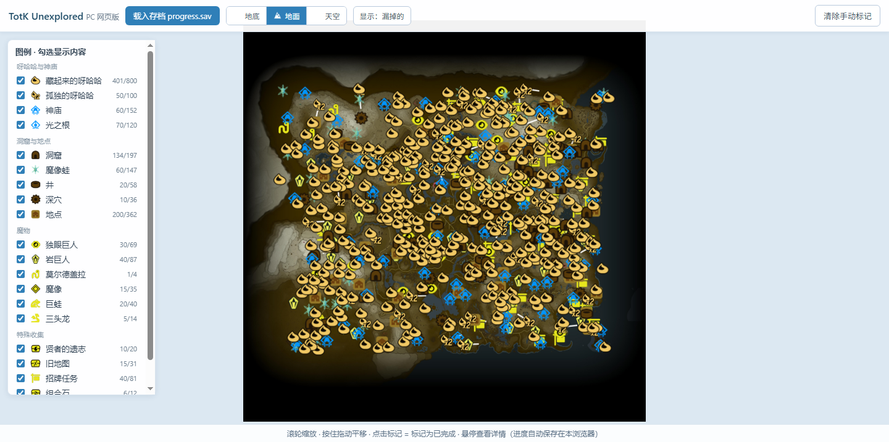

---
AIGC:
  ContentProducer: '001191110102MAD55U9H0F10002'
  ContentPropagator: '001191110102MAD55U9H0F10002'
  Label: '1'
  ProduceID: '35ec269f-e54d-4098-a08c-1e06af632362'
  PropagateID: '35ec269f-e54d-4098-a08c-1e06af632362'
  ReservedCode1: '4214a20e-3132-49e2-9e67-e2d2d1df8b8a'
  ReservedCode2: '4214a20e-3132-49e2-9e67-e2d2d1df8b8a'
---

# yan totk unexplored

《塞尔达传说 王国之泪》存档查漏地图的 **PC 网页版**，把 Switch homebrew [lud99/totk-unexplored](https://github.com/lud99/totk-unexplored) 的解析逻辑完整移植到浏览器。

**在线演示：https://nbvalue.github.io/yan-totk-unexplored/**



## 功能

- **20 类收集要素**全部追踪（与 Switch 版图例一致，图标取自原版 romfs）：

  | 呀哈哈与神庙 | 洞窟与地点 | 魔物 | 特殊收集 |
  |---|---|---|---|
  | 藏起来的呀哈哈 ×800 | 洞窟 ×197 | 独眼巨人 ×69 | 贤者的遗志 ×20 |
  | 孤独的呀哈哈 ×100 | 魔像蛙 ×147 | 岩巨人 ×87 | 旧地图 ×31 |
  | 神庙 ×152 | 井 ×58 | 莫尔德盖拉 ×4 | 招牌任务 ×81 |
  | 光之根 ×120 | 深穴 ×36 | 魔像 ×35 | 组合石 ×12 |
  |  | 地点 ×362 | 巨蛙 ×40 | 依盖队图纸 ×34 |
  |  |  | 三头龙 ×14 |  |

- **地底 / 地面 / 天空三层地图**自由切换（按高度自动分层：天空 ≥750、地底 ≤-50）
- **三种显示模式**：漏掉的 / 已完成的 / 全部（对应 Switch 版 legend 的 Show 模式）
- 手动载入存档 `progress.sav`（按钮选择或拖入窗口）
- 滚轮缩放（以鼠标为锚点）、鼠标拖动平移
- 悬停显示详情：名称、呀哈哈解谜类型（23 种中文对照，如花之路、风车气球、举石……）、魔像蛙所在洞窟、所在层与高度
- 点击标记 = 标记为已完成，进度自动保存在浏览器（localStorage）
- **呀哈哈寻找路径**：背呀哈哈的朋友路线、花之路的每朵花按顺序连线
- **洞窟多入口连线**：同名洞窟的两个入口之间画线
- 贤者的遗志、招牌任务按 **GUID（u64 BigInt）** 精确匹配；神庙/光之根按状态码精确判定（'Clear'/'Open'），与原版逻辑逐行对齐

## 使用

访问在线演示，或下载本仓库后直接双击 `index.html`（纯静态、零依赖、可离线使用，存档数据全程在本地浏览器解析，不上传任何服务器）。

存档文件位置（Switch SD 卡）：

```
switch/totk-unexplored/saves/<用户UID>/slot_0<N>/progress.sav
```

`N` 为 0~5 的存档槽。建议先在 Switch 上打开一次 totk-unexplored nro 刷新备份，再取出文件。

## 技术说明

- 存档解析移植自 lud99 的 `SavefileIO.cpp`：从 `0x28` 每 8 字节扫描 flag hash，遇 `MetaData.SaveTypeHash`（0xa3db7114）结束，其后为 GUID 数组
- 全部数据来自原项目 `romfs/map_data.json`（2399 条），坐标映射 `像素 = 750 ± 世界坐标/8`（1500×1500 底图）
- 地图底图（surface/depths/sky small 版）与 20 类图标取自原项目 romfs 资源
- Canvas 渲染引擎：滚轮缩放、拖动平移、点击命中检测均为原生实现

## 致谢

- [lud99/totk-unexplored](https://github.com/lud99/totk-unexplored)（Switch 版原作，数据与解析逻辑来源）
- [marcrobledo/savegame-editors](https://github.com/marcrobledo/savegame-editors)（存档 hash 与状态码研究）
- [zeldamods/objmap-totk](https://github.com/zeldamods/objmap-totk)、[zeldamods/radar-totk](https://github.com/zeldamods/radar-totk)（对象数据与克洛格路径）

> AI生成